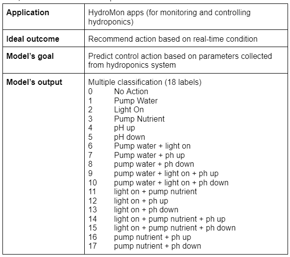
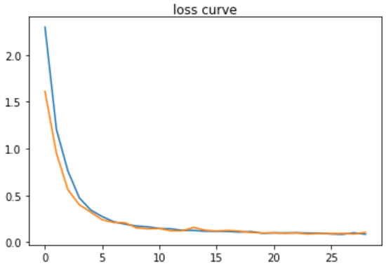
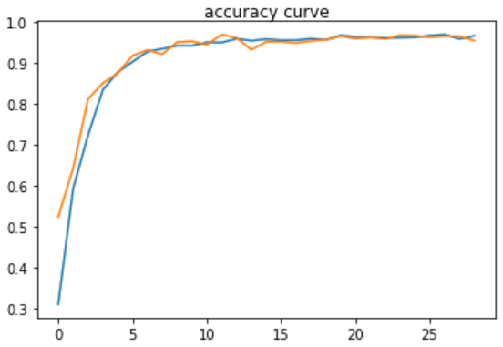

# HydroMon Apps - Machine Learning Aspect🤖

## 📃Table of Contents
- [HydroMon Apps - Machine Learning Aspect🤖](#hydromon-apps---machine-learning-aspect)
  - [📃Table of Contents](#table-of-contents)
  - [📖Project Background](#project-background)
  - [📱HydroMon Apps](#hydromon-apps)
  - [🎞️Framing ML Problem](#️framing-ml-problem)
  - [🔍Data Collection and EDA](#data-collection-and-eda)
  - [📈📉Modelling](#modelling)
  - [⚒️ Future of Work](#️-future-of-work)
  - [🧑🏻‍💻👩🏻‍💻Contributors](#contributors)

## 📖Project Background 
Urban farming is currently on the rise due to the increasing urbanization movement. One of
most popular urban farming is hydroponic planting as plants that grow in a hydroponic set up are healthier, more nutritious and grow quickly but also yield more. However,
technology/automation and digitalization are needed to support the production process as
well as its commercialization. 

## 📱HydroMon Apps
HydroMon is an application that enables the farmers to manage and control their hydroponic plants from remote areas, especially to monitor crucial for the plants well-being. As for now, hydroponic farmers need to manually monitor their plants and obviously not effective. It can be used to monitor the hydroponic system so farmers don't need to be on guard all day long. The recommended-action feature helps farmers to make decisions in order to minimize human-error. 

## 🎞️Framing ML Problem
The goal is to predict control action based on hydroponics parameters. Thus, the model output will be multiclass classification. Multiclass classification are those predictive modeling problems where examples are assigned one or more than two classes. The problem here is to predict numeric values from hydroponic parameters, where each class is assigned a unique integer value as the label from 0 to 17, to predict the probability of the example belonging to each known class.

      

## 🔍Data Collection and EDA
We collect datasets by conducting exploration and benchmarking with datasets from several sources. The attributes in the dataset are pH, air temperature, TDS, EC, light intensity and humidity. Then the exploratory data analysis stage is carried out to study and explore the relationship between those attributes. 

1000 dummy data randomly be generated on google spreadsheet which will be used for training and testing. Also, we do the labeling process on the dummy data that has been generated according to the following  [guidelines](https://github.com/HydroMon/hydromon-machine-learning/blob/main/labelling/hydroponic_labelling.js). After that, the first iteration is carried out for modeling with a few parameters. The resulting model is still overfitting due to the lack of steps carried out in data preprocessing such as the uneven distribution of data representing each label.

In the next iteration, we increase the number of datasets to 18,000 with each label represented by 1000 data. The data is split into training and testing with a ratio of 80:20. 

## 📈📉Modelling
We used Deep Neural Network for the algorithm using 5 layers consisting of 1 input layer, 3 hidden layers and 1 output layer. We managed to train a model with 18.000 data which is splitted into training and testing sets. We trained the model using 14.400 data (80% of actual data) and then applied the model to the test set with 3.600 data (20% of actual data). In the first iteration, we implemented a simple model with few features.

As we got bad model performance, we decided to explore more about data preprocessing then applied normalization and data shuffling.  Afterwards, model performance increased extremely, but still needed some improvement so we did hyperparameter tuning on the next iteration. Hyperparameter tuning is done such as the number of layers on the neural network, learning rate, unit of neurons and others. The training process is displayed in the form of loss and accuracy graphs to address whether underfitting or overfitting occurs during training. If the loss and accuracy have reached convergence, the training process can be stopped.

We also visualized loss and accuracy while training to monitor whether there is underfitting or overfitting on the model. The result that we got is about 8,49% loss and 96.61% accuracy.

      
    

In the last iteration, the checkpoint and early stop models were added. Then, the model is saved in the SavedModel format and converted to TensorFlow Lite for further deployment to the Android application. We also testing the model with TensorFlow Lite interpreter.

## ⚒️ Future of Work
1. Dataset used is still a dummy, the next plan is to take the original data from hydroponics and use it for training.
2. The model developed is specific for only one plant, tomatoes. Next, we want to develop a model that is able to classify the condition of the plants added by the user.
3. If the point in number 2 is implemented, then an image classification model will be developed to detect hydroponic plants so that the addition of plants is not done manually.
4. Current labelling is not optimal because it has repetition and redundancy. For the next development, we will try multilabel classification so that only 6 labels are used, but each data can have multilabel according to the required conditions.

## 🧑🏻‍💻👩🏻‍💻Contributors
* [Amanda Rozi Kurnia](github.com/yoursemicolon)
* [Muhammad Nadhif Athalla](https://github.com/nadhifathalla26)
* [Syahrizal Faried Roosydi](https://github.com/Syz232)